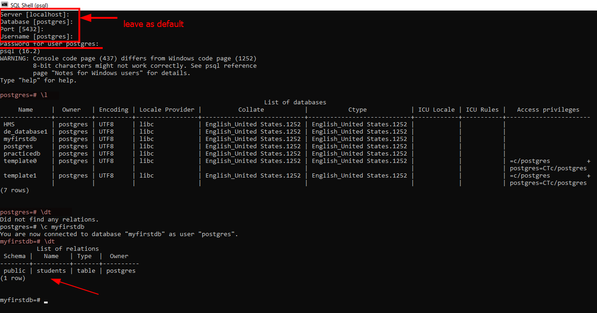

# Data Model

## Basics of Data model

### what is data model?

A data model is an abstract model that **organizes elements of data** and standardizes **how they relate to one another** and to the properties of real-world entities.

### Why is Data Modeling Important?

- A data model is like a blueprint for organizing information in a database.
- It helps in understanding how data relates to each other.
- It guides how data should be stored and accessed.
- Without a data model, managing and using data would be messy and disorganized.
- So, a data model is essential for keeping data organized, consistent, and easy to work with.

### Who Does This Type of Work?

- Data Scientist
- Software Engineers
- Data Engineers
- Anyone involved in the process of using and analyzing data

### Relational Model and Database

Organizes data into one or more tables of columns and rows, with a unique key identifying each row.

#### Database/Schema

- Collection of Tables
  
#### Tables/Relations

- A group of rows sharing the same labeled elements.
  - Students
  - Subjects
  - Marks

#### Advantages of using a Relational Database

- Ease of use - SQL
- Ability to do JOINS
- Ability to do aggregations and analytics
- Smaller Data Volumes
- Flexibility of queries
- ACID transactions - data integrity

### ACID Properties

[ACID_Blog](https://notes123.hashnode.dev/acid-properties)

#### When to not use Relational Database

- Large amounts of Data
- Need to be able to store different data types formats
- Need a flexible schema
- Need high availability
- Need horizontal scalability

## Exercise 1 - Creating Tables in Postgres using python

refer - [1_working_with_postgresDB_through_python.ipynb](1_working_with_postgresDB_through_python.ipynb)

### postgres shell commands

 

| Command            | Description                             |
| ------------------ | --------------------------------------- |
| `\l`               | List all databases                      |
| `\q`               | Close the current database connection   |
| `\dt`              | List all tables in the current database |
| `\c database_name` | Connect to a specific database          |

## Reference

- [Data Modeling Tutorial | Data Modeling for Data Warehousing | Data Warehousing Tutorial | Edureka](https://www.youtube.com/watch?v=acNmHwl9iPs)
- [Guru99](https://www.guru99.com/data-modelling-conceptual-logical.html)

🎯  Get Data Set For Project\
👉 [opendata.aws](https://registry.opendata.aws/)\
👉 [dataset search](https://datasetsearch.research.google.com/)\
👉 [UCI Dataset](https://archive.ics.uci.edu/datasets)\
👉 [kaggle](https://www.kaggle.com/datasets)
